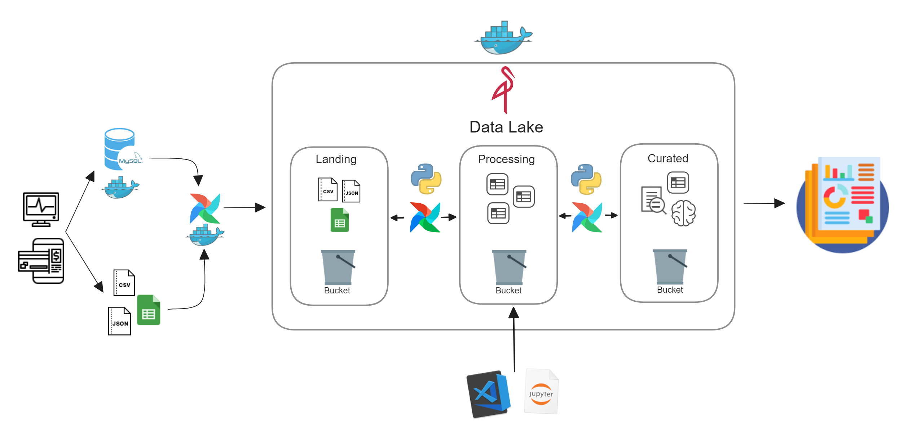
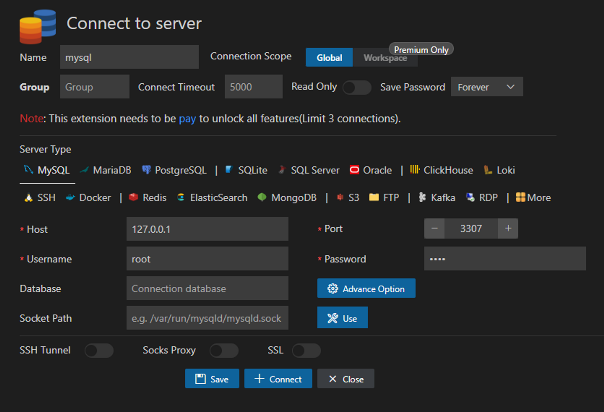
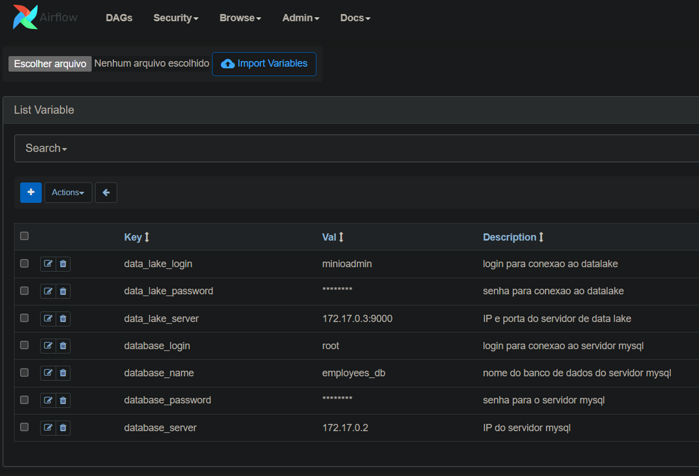
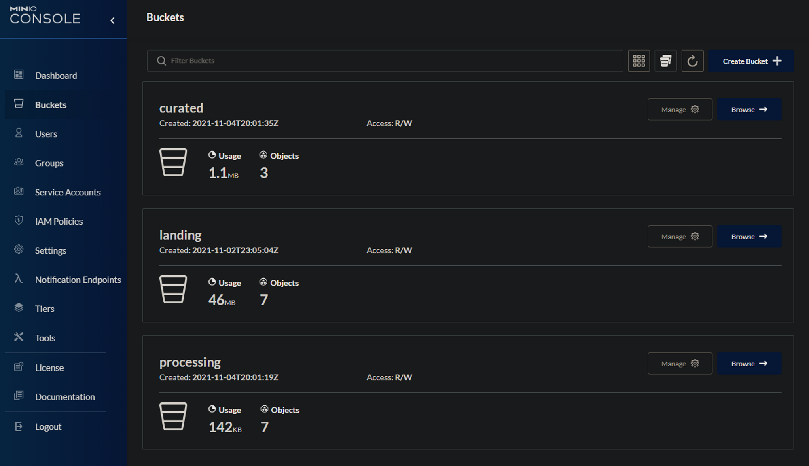
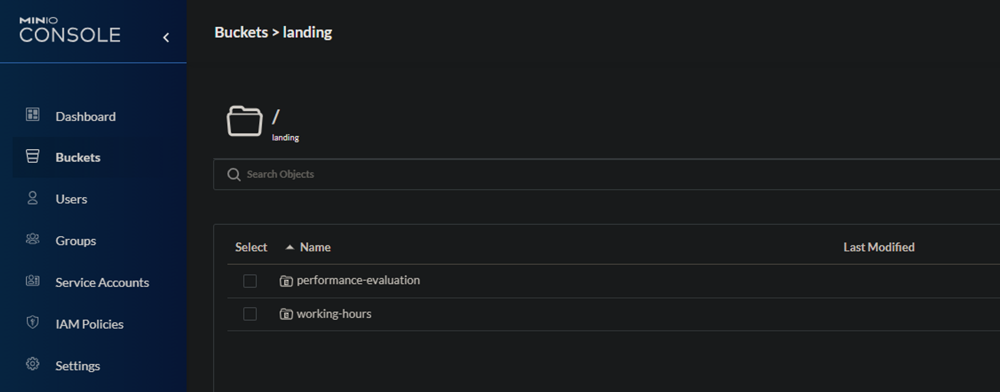
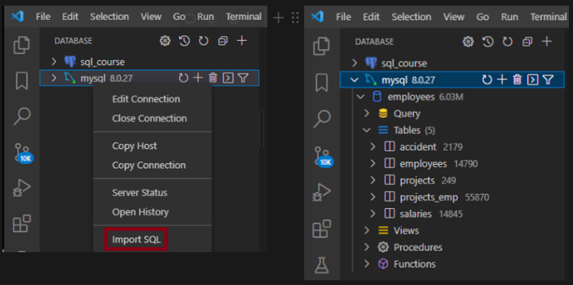
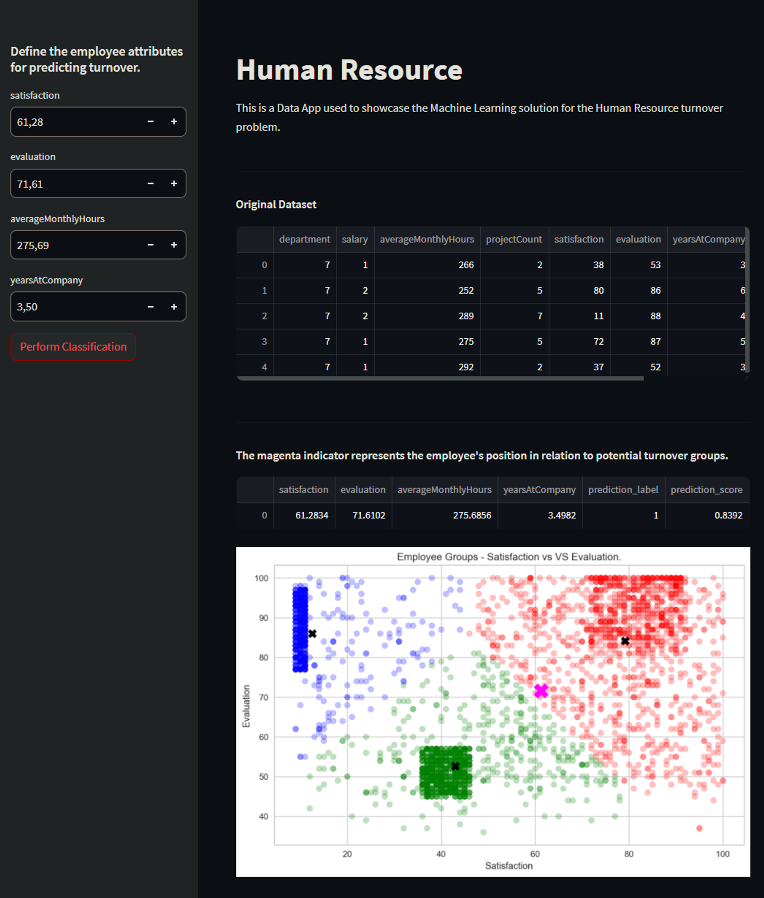

# Rotatividade de Funcionários (Turnover)

### Introdução

Neste projeto de Análise de Recursos Humanos, temos como objetivo responder questões-chave sobre gestão de talentos e rotatividade de colaboradores em uma empresa fictícia. Após configurar a infraestrutura, \
modelamos atributos relevantes a partir de fontes variadas: arquivos `xlsx`, `json` e um banco de dados `MySQL`. Em seguida, realizamos uma análise dos dados para identificar fatores de desligamento. 
No decorrer do projeto, desenvolvemos habilidades em `Data Science` e `Engenharia de Dados`. Como resultado final, criamos um aplicativo interativo no `Streamlit` para visualizar nossos insights e os 
resultados do modelo de `Machine Learning`, que determina se um colaborador pode deixar a empresa. Para isso, utilizamos tecnologias como `Apache Airflow`, `Docker` e `Minio` para automatizar fluxos de 
dados e empregamos ferramentas como `Pandas`, `Scikit-learn`, `Pycaret,` `SweetViz` para otimizar nossa análise. O aplicativo interativo fornece uma abordagem eficiente e abrangente para lidar com os desafios 
da gestão de recursos humanos e identificar possíveis candidatos a deixar a empresa.

### Overview



### Objetivos

- Entender quais são os fatores que influenciam para um colaborador desejar deixar a empresa
- Antecipar e saber se um determinado colaborador vai sair da empresa

### Instalação

Criar, instalar e ativar o ambiente  Anaconda: 

```
conda env create -f environment.yml.
```

## **Etapa 01 - Criação dos Containers**

Criar containers simulando um ambiente real de produção.

### MySQL Server

1. Criar o container do MySQL habilitando a porta 3307 executando o comando via terminal Powershell:
    
```
docker run --name mysqlbd1 -e MYSQL_ROOT_PASSWORD=0000 -p "3307:3306" -d mysql
```


`Host: 127.0.0.1| Username: root | Port: 3307 | Password: 0000`

### Data Lake com Minio Server

1. Dentro do diretório projeto crie o diretório ***datalake***.
2. Execute o comando via terminal Powershell:
   
```
docker run --name minio -d -p 9000:9000 -p 9001:9001 -v "$PWD/datalake:/data" minio/minio server /data --console-address ":9001”
```

[http://localhost:9000](http://localhost:9000/login)
`| username: minioadmin | password: minioadmin`

### Airflow

1. Dentro do diretório projeto criar o diretório ***airflow***.
2. Navegar até o diretório airflow e criar o diretório ***dags***.
3. Execute o comando via terminal Powershell:

```
docker run -d -p 8080:8080 -v "$PWD/airflow/dags:/opt/airflow/dags/" --entrypoint=/bin/bash --name airflow apache/airflow:2.1.1-python3.8 -c '(airflow db init&& airflow users create --username admin --password 0000 --firstname Andre --lastname Lastname --role Admin --email [admin@example.org](mailto:admin@example.org)); airflow webserver & airflow scheduler'
```

[https://localhost:8080](https://localhost:8080/)
`Login: admin | Senha: 0000`
> 
1. Instalar as bibliotecas necessárias para o ambiente:
    1. Execute o comando para se conectar ao container do airflow: 
        ```
        docker container exec -it airflow bash`
        ```
        
    2. Instalar as bibliotecas:
        ``` 
        pip install pymysql xlrd openpyxl minio
       ```
        
2. Criar as variáveis em ***Admin > Variables***



`data_lake_server = 172.17.0.3:9000 | data_lake_login = minioadmin| data_lake_password = minioadmin | database_server = 172.17.0.2 (executar: docker container inspect mysqlbd1 e localizar o atributo: IPAddress) | database_login = root | database_password = 0000 | database_name = employees`

### Criação dos Dados

1. Criar os buckets ***landing, processing*** e ***curated.***



1. No bucket ***landing***, criar a pasta ***performance-evaluation***, nela será inserido o arquivo json referente a avaliação individual do desempenho dos funcionários realizados pela empresa. 
2. Ainda no bucket ***landing***, criar outra pasta chamada ***working-hours,*** nela serão inseridos arquivos .xlsx referente as horas trabalhadas pelos funcionários.



### Subindo e carregando o banco de dados

1. Importar arquivo ***employees_db.sql*** contendo o script para criação do banco de dados (localizado na pasta ***database*** do projeto)


## **Etapa 02 - Preparação dos Dados**

Exploraremos um pipeline que extrai, transforma e cria recursos a partir de dados de funcionários de uma empresa fictícia. Utilizaremos bibliotecas Python como Pandas e SQLAlchemy para lidar com dados de várias fontes.

1. Extração de Dados do Banco de Dados e do Data Lake
2. Criação de Recursos (features):
    1. Dados de Avaliação de Desempenho
    2. Número de Projetos por Funcionário
    3. Média de Horas de Trabalho nos Últimos 3 Meses
    4. Tempo na Empresa
    5. Incidência de Acidentes de Trabalho
    6. Departamento, Salário e Status de Emprego (Ativo ou Inativo)
   
Códigos originais: [`make_dataset.py`](src/data/make_dataset.py)

Passo a passo explicado: [`01_make_dataset.ipynb`](notebooks/01_make_dataset.ipynb)

## **Etapa 03 - Exploratory Data Analysis (EDA)**

Elaborar scripts para processar, visualizar e modelar os dados, permitindo a geração de insights que ampliem a compreensão dos desafios enfrentados. Além disso, interpretar os indicadores de desempenho em relação ao problema a ser solucionado. 

1. Lidando com valores faltantes
2. Criando estatísticas para melhor entendimento do problema

Durante a fase de Análise Exploratória de Dados, identificamos diversos insights relevantes, conforme listados abaixo:

3. A empresa registra uma taxa de rotatividade de 24%.
4. Pode-se inferir que funcionários com maior índice de saída estão menos satisfeitos.
5. Há um número substancial de colaboradores insatisfeitos.
6. A maioria dos funcionários que deixaram a empresa tinha salários baixos ou médios.
7. Os departamentos de Vendas, Técnico e Suporte são os três principais com maiores índices de rotatividade.
8. Todos os colaboradores com envolvimento limitado em projetos deixaram a empresa.
9. Aqueles com desempenho inferior apresentam maior probabilidade de saída.

Códigos originais: [`visualize.py`](src/visualization/visualize.py)

Passo a passo explicado: [`02_visualize.ipynb`](notebooks/02_visualize.ipynb)


## **Etapa 04 - Feature Engineering**

Com base nas análises da fase anterior, foi possível, por meio da utilização do agrupamento K-Means, criar 3 grupos distintos para categorizar colaboradores que deixaram a empresa de acordo com comportamentos semelhantes. Estes grupos são:

1. Hardworking and satisfied employees.
2.  Poor-performing and dissatisfied employees.
3. Hardworking but unhappy employees.

Códigos originais: [`build_features.py`](src/features/build_features.py)

Passo a passo explicado: [`03_build_features.ipynb`](notebooks/03_build_features.ipynb)

## **Etapa 05 - Treinando o Modelo**

Conduzir experimentos para selecionar features, escolher um modelo e ajustar hiperparâmetros em busca da combinação que maximiza a precisão na classificação dos funcionários.

1. Feature selection usando Decision Tree
2. Criando um modelo para usar como baseline
3. Criando métricas para avaliacao dos modelos
4. Curva ROC
5. Comparando os modelos:
6. Comparando modelos (Logistic Regression, Decision Tree, Random Forest)
7. Utilizando Automated Machine Learning (PyCaret)

Códigos originais: [`train_model.py`](src/models/train_model.py)

Passo a passo explicado: [`04_train_model.ipynb`](notebooks/04_train_model.ipynb)


## **Etapa 06 - Data APP**

Este aplicativo utilizando Streamlit apresenta uma solução de Aprendizado de Máquina para prever a rotatividade de Recursos Humanos.

Permitindo que os usuários definam atributos dos funcionários para a previsão, ele exibe a posição do funcionário em grupos potenciais de rotatividade com um indicador magenta. O aplicativo realiza classificação usando o modelo treinado e exibe os resultados junto com uma visualização dos grupos de funcionários com base em pontuações de satisfação e avaliação.

### Utilização

Para executar o aplicativo, siga estes passos:

1. Abra o prompt de comando ou terminal.
2. Navegue até o diretório onde o arquivo app.py está localizado usando o comando cd. Por exemplo:`(base) D:\\Projetos\\rotatividade-funcionarios\\app>`
3. Execute o aplicativo Streamlit usando o seguinte comando:
```
streamlit run app.py
```
4. O aplicativo será lançado em seu navegador da web padrão. Agora você pode interagir com o aplicativo para prever a rotatividade de funcionários com base em diferentes atributos.



