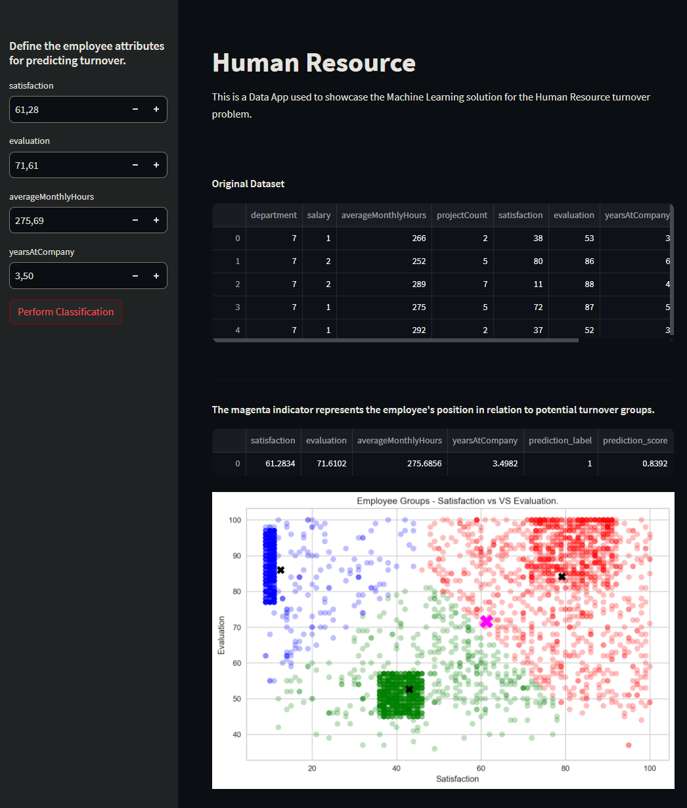

**Códigos orignais:** [app.py](app.py)

## INTRO

This Streamlit app showcases a Machine Learning solution for predicting Human Resource turnover.

It allows users to define employee attributes for prediction and displays the employee's position in potential turnover groups with a magenta indicator. The app then performs classification using the trained model and displays the results along with a visualization of employee groups based on satisfaction and evaluation scores.

## RUNNING

To run the app follow these steps:

1. Open your command prompt or terminal.
2. Navigate to the directory where the [app.py](http://app.py/) file is located using the `cd` command. For example:
   `(base) D:\\Projetos\\rotatividade-funcionarios\\app>`
3. Run the Streamlit app using the following command: `streamlit run app.py`
4. The app will launch in your default web browser. You can now interact with the app to predict employee turnover based on different attributes.

_Enjoy exploring the app and gaining insights into employee turnover predictions!_

